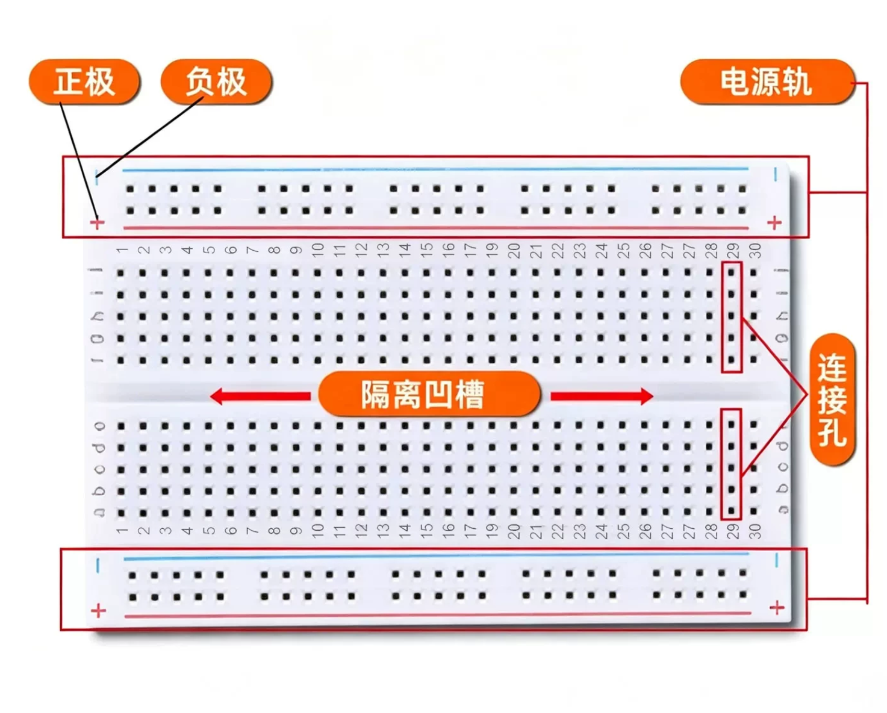

# 面包板（MB102 一类）说明书摘录

来源：商品详情「面包板结构示意」。用语与详情页标注一致：**电源轨、连接孔、隔离凹槽、正极、负极**。

## 三块怎么通

| 名称（详情页用语） | 怎么通 | 怎么认 |
|--------------------|--------|--------|
| **电源轨** | 红线「**+**」/ 蓝线「**−**」各自**沿线横向连通** | 板上下两侧（或左右长条，视摆放）的红蓝长条 |
| **连接孔** | 中间区**同一列**的 a–e（或 f–j）**五个孔纵向连通**；相邻列不通 | 有数字列号、字母行号的主区 |
| **隔离凹槽** | 正中沟**上下互不通** | 板正中那条长槽 |

要点：

- **正极**对应电源轨上的「+」；**负极**对应「−」。  
- 电源轨横向通；连接孔纵向通。  
- 跨过隔离凹槽必须另用跳线或元器件跨接，不能默认上下已连通。

## 和本课接线的关系（一句）

电源轨上的「+ / −」印刷本身不带电；排针 **5V / GND**（或 3.3V）经杜邦线接入后，整条轨才有电，再从轨上分线到模块。信号线插在**连接孔**里，与要相连的脚放在**同一列**。

## 配图

