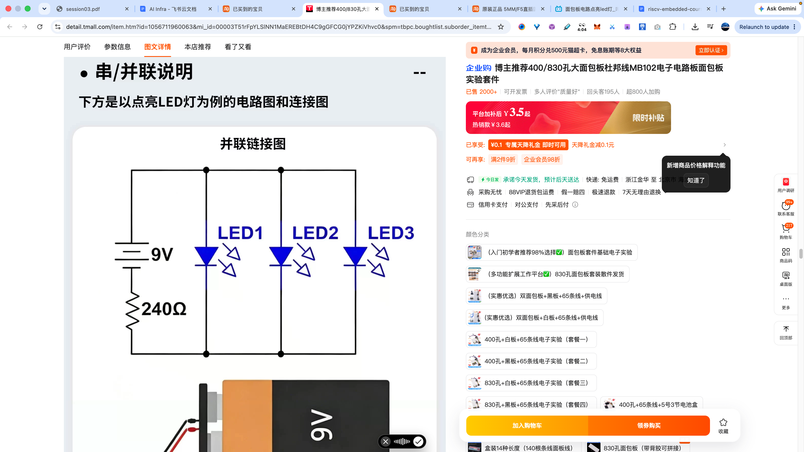
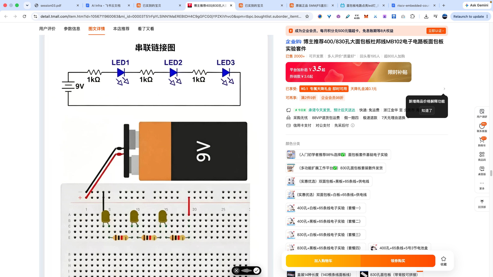
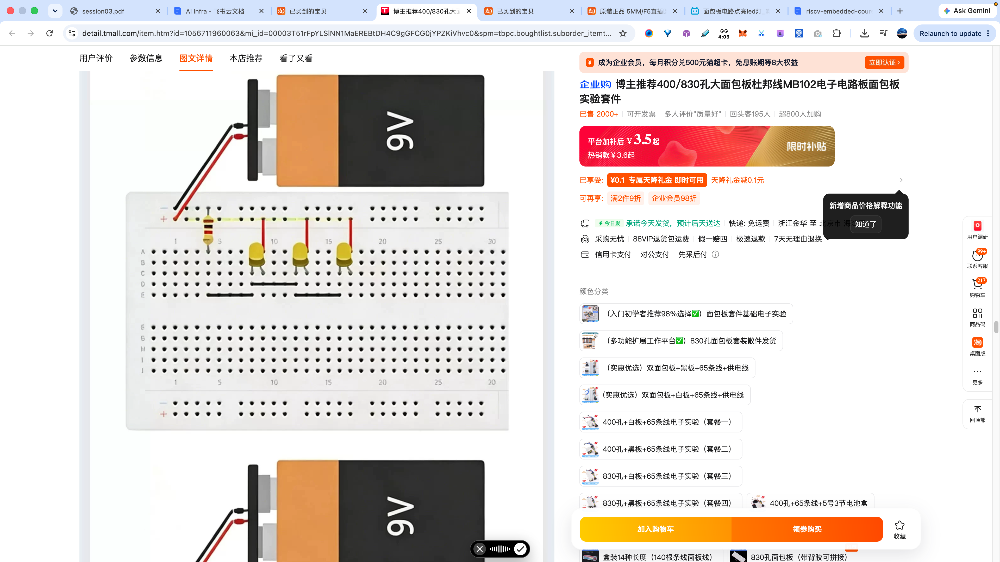

# 串联 / 并联点亮 LED（商品详情示意）

来源：面包板套件商品详情中的「串联链接图」「并联链接图」（电池 + 电阻 + LED）。

> **本课控灯不照抄此图。** 详情页是电池（如 9V）经电阻点亮 LED 的演示；第五章是 **GPIO（如 IO1_4）→ 电阻 → LED 长脚，短脚回 GND**，由程序拉高/拉低，而不是接电源轨正极常亮。

## 详情页在说什么

| 用语 | 含义 |
|------|------|
| **串联链接图** | 电阻与若干 LED 串在一条回路里，电流依次流过 |
| **并联链接图** | 若干 LED 并在一起，各有回负极的支路；前面常有公共限流电阻 |

这些图只用来建立「电阻限流、LED 有正负极（长脚正极 / 短脚负极）」的直觉。

## 配图

### 并联链接图



### 串联链接图



### 串联在面包板上的接法示意



## 本课实际接法（对照）

```
IO1_4  →  限流电阻  →  LED 长脚（正极）
电源轨「−」（GND）  →  LED 短脚（负极）
```

本课开关是 GPIO：正极经电阻接 `IO1_4`，短脚回电源轨「−」。
